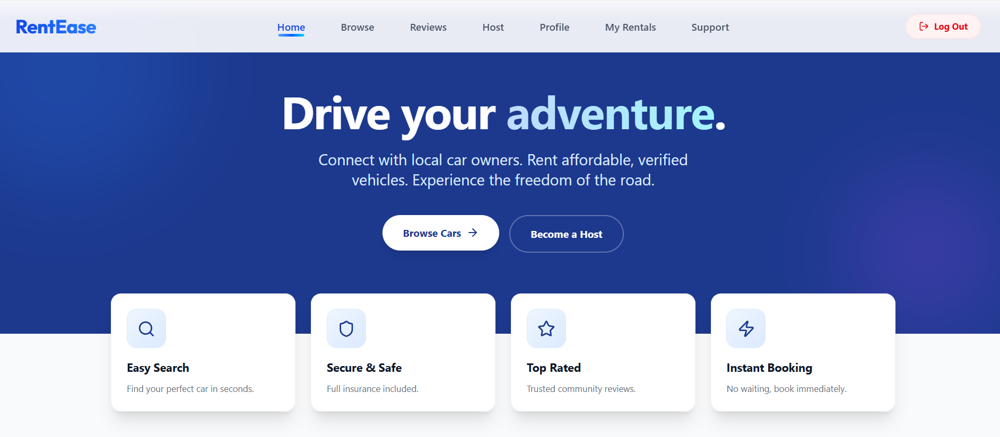
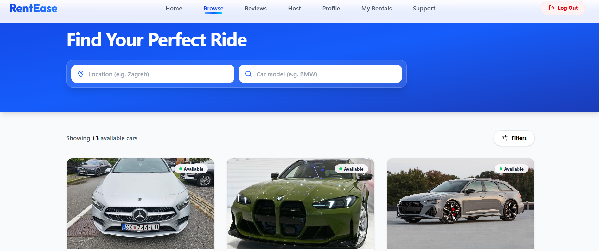
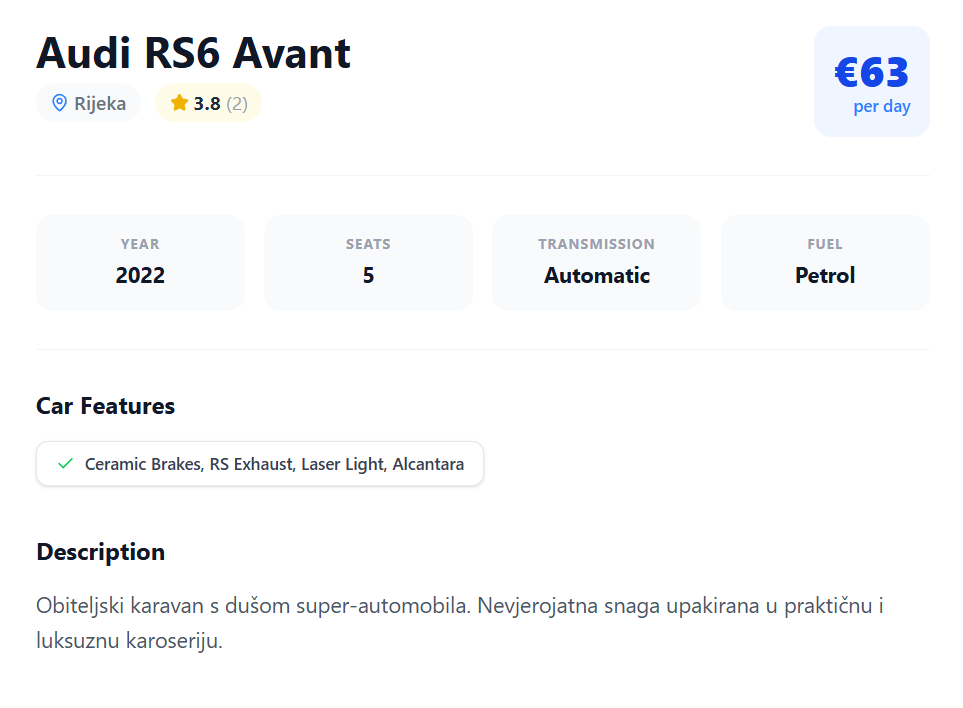
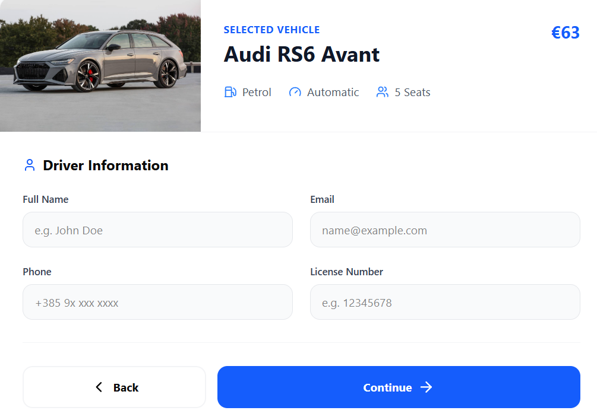
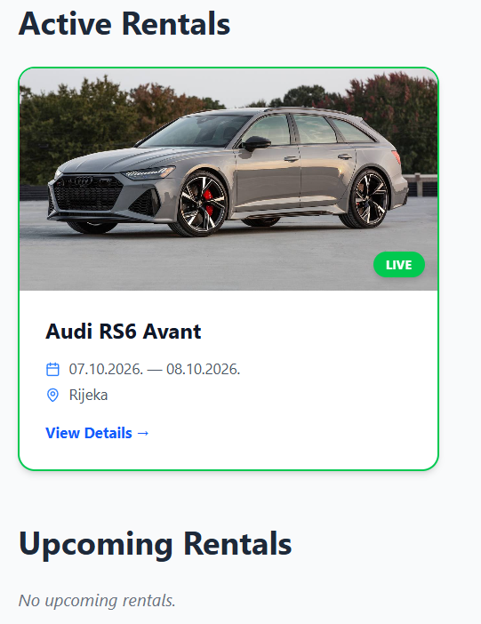

# 🚗 Rent-a-Car Web Application

A full-stack web application for browsing and renting vehicles, developed as a **collaborative university project**.

The application allows users to browse available vehicles, view detailed information, check availability, make reservations and manage their rentals.

## ✨ Features

- 🔐 User authentication
- 🚗 Browse available vehicles
- 🔎 Search and filter vehicles
- 📄 Detailed vehicle information
- 📅 Rental date selection
- ✅ Vehicle availability checking
- 📝 Vehicle reservations
- ⭐ User reviews and ratings
- 👤 User profile
- 📋 Rental history and active rentals
- 📱 Responsive interface

## 🛠️ Technologies

### Frontend
- Next.js
- React
- TypeScript
- Tailwind CSS

### Backend & Database
- Supabase
- PostgreSQL

### Content Management
- Contentful

### Deployment & Tools
- Vercel
- Git
- GitHub

## 🏗️ Architecture

The application uses a combination of **Supabase** and **Contentful**.

Supabase is used for functionality such as:

- user authentication
- bookings
- reviews
- user profiles
- database operations

Contentful is used as a content management system for vehicle information and media.

The Next.js application integrates both services into a single application.

## 👨‍💻 My Contribution

This project was developed collaboratively with a colleague.

My contributions included working on the **Next.js application, vehicle browsing and detail pages, booking flow, Contentful integration and database-related functionality**.

I also worked on connecting the frontend with Supabase and implementing functionality required for users to browse vehicles and make rental reservations.

## 📸 Screenshots

### Home Page



### Browse Vehicles



### Vehicle Details



### Booking



### Rental Management



## 🚀 Getting Started

### 1. Clone the repository

```bash
git clone https://github.com/barti-kujundzic/rent-a-car-app.git
cd rent-a-car-app
```

### 2. Install dependencies

```bash
npm install
```

### 3. Configure environment variables

Create a `.env.local` file and add the required environment variables:

```env
NEXT_PUBLIC_SUPABASE_URL=
NEXT_PUBLIC_SUPABASE_ANON_KEY=

NEXT_PUBLIC_CONTENTFUL_SPACE_ID=
NEXT_PUBLIC_CONTENTFUL_ACCESS_TOKEN=
```

Additional environment variables may be required depending on the configured services.

### 4. Run the development server

```bash
npm run dev
```

The application will be available at:

```text
http://localhost:3000
```

## 🌐 Live Demo

https://rentease-psi-gray.vercel.app/

## 📚 What I Learned

Through this project I gained practical experience with:

- Building full-stack applications with Next.js
- TypeScript and React development
- Working with PostgreSQL through Supabase
- User authentication
- Database-driven booking systems
- Content management with Contentful
- Integrating external services
- Git and collaborative development
- Deploying web applications with Vercel
